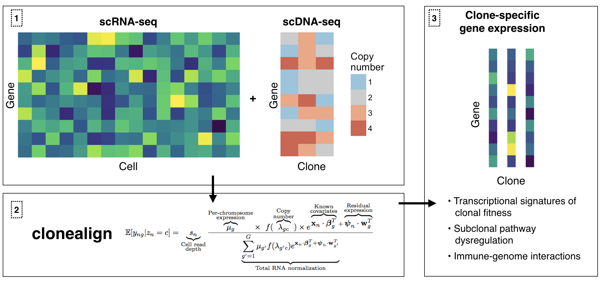

# clonealign

clonealign assigns single-cells to their clones of origin by mapping RNA-seq to clone-specific copy number profiles. This is particularly useful when clones have been inferred using ultra-shallow single-cell DNA-seq meaning SNV analysis is not possible.

