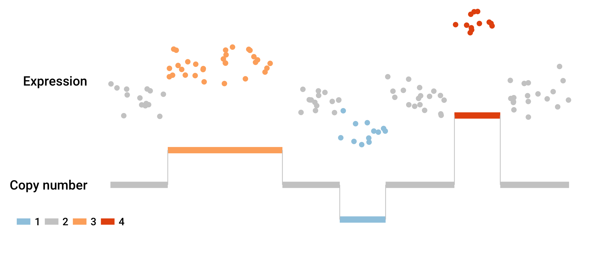

```{r setup, include = FALSE}
knitr::opts_chunk$set(
  collapse = TRUE,
  comment = "#>",
  cache = TRUE
)


library(SingleCellExperiment)
library(scater)

```


# Overview

`clonealign` assigns cells measured using single-cell RNA-seq to their clones of origin using copy number data. This is especially useful when clones are inferred from shallow single-cell DNA-seq, in which case the copy number state of each clone is known, but the precise SNV structure is unknown.

To assign cells to clones, `clonealign` makes the assumption that

$$ \text{gene expression} \propto \text{number of gene copies} $$

This is demonstrated in the figure below.



Mathematically we have an $N \times G$ matrix $Y$ of raw gene expression counts (from RNA-seq) for $N$ cells and $G$ genes, where $y_{ng}$ is the counts to gene $g$ in cell $c$. We also have a $G \times C$ matrix $\Lambda$ of copy number variation for $C$ clones, where $\lambda_{gc}$ is the copy number of gene $g$ in clone $c$. We introduce a clone-assigning categorical variable $\pi_n$ for each cell, where

$$ \pi_n = c \text{ if cell $n$ on clone $c$} $$

then `clonealign` models the conditional expected counts in a gene and cell as

$$ E[y_{ng} | \pi_n=c] = \frac{\lambda_{g,c} \mu_g}{ \sum_{g'}\lambda_{g',c} \mu_{g'}} s_n  $$

where $s_n$ is a cell-specific size factor and $\mu_g$ is the per-chromosome expression (normalized so that $\mu_1 = 1$ for model identifiability). The noise distribution is assumed to be negative-binomial. Inference is performed using expectation-maximization to find maximum likelihood estimates of the clone assignments $\pi_n$ and of all other model parameters.

# Installation

`clonealign` is built upon [Google's Tensorflow](https://www.tensorflow.org/) using the [Tensorflow R package provided by Rstudio](https://tensorflow.rstudio.com/). To install `tensorflow`, run 

```{r, eval=FALSE}
install.packages("tensorflow")
library(tensorflow)
install_tensorflow()
```

You can confirm the installation succeeded by running

```{r,eval=FALSE}
sess = tf$Session()
hello <- tf$constant('Hello, TensorFlow!')
sess$run(hello)
```

For more details see the [Rstudio page on tensorflow installation](https://tensorflow.rstudio.com/tensorflow/articles/installation.html).

`clonealign` can then be installed using the `devtools` package via

```{r, eval=FALSE}
devtools::install_github("kieranrcampbell/clonealign")
```

 
# Basic usage

## Data preparation

By default, `clonealign` requires two inputs:

* Gene expression data as raw counts. This can be in the form of a `SingleCellExperiment`, `SummarizedExperiment` or **cell by gene** `matrix`
* Copy number profiles for each clone and gene (where the genes **must** be the same as those measured in the expression data). This can be in the form of a `data.frame`, `DataFrame` or `matrix`

Bundled with the package is an example `SingleCellExperiment` for 100 genes and 200 cells:

```{r}
library(clonealign)
data(example_sce)
example_sce
```

This has raw integer counts in the `assays` slot as required for input to `clonealign`:

```{r}
assay(example_sce, "counts")[1:5, 1:5]
```


The CNV data is stored in the `rowData` of the `SingleCellExperiment` for 3 clones (A, B, and C) and crucially the same genes as the expression data:

```{r}
cnv_data <- rowData(example_sce)[, c("A", "B", "C")]
stopifnot(nrow(cnv_data) == nrow(example_sce)) # Make sure genes match up
head(cnv_data)
```


## Model fitting

The model is fitted with a basic call to `clonealign`, which prints the (relative change in) log-likelihood for each iteration (this can be turned off by setting `verbose = FALSE`):

```{r}
cal <- clonealign(example_sce, cnv_data)
```

```{r}
print(cal)
```

We can plot the marginal likelihood values to ensure convergence:

```{r}
qplot(seq_along(cal$log_lik), cal$log_lik, geom = c("point", "line")) +
  labs(x = "Iteration", y = "Log-marginal-likelihood")
```

The maximum likelihood estimates of the clone assignments can be access through the `clone` slot:

```{r}
clones <- cal$clone
table(clones)
```

This can easily be added to the `SingleCellExperiment` for visualization with `scater`:

```{r}
example_sce$clone <- clones
example_sce <- normaliseExprs(example_sce)
plotPCA(example_sce, ncomponents = 3, colour_by = "clone")
```

The clone assignments in `clones` can then be used for the desired downstream analysis, such as differential expression or SNV analysis.

# Advanced options


## Controlling the EM algorithm

Inference is performed using the [EM algorithm](https://en.wikipedia.org/wiki/Expectation-maximization_algorithm)
which uses the log marginal likelihood to monitor convergence. This is controlled using the
`rel_tol_em` parameter. When the difference 

$$ \Delta L = \frac{L_{\text{new}} - L_{\text{old}}}{|L_{\text{old}}|} $$
falls below `rel_tol_em`, the EM algorithm is considered converged. The maximum number of iterations to acheive this is set using the `max_iter_em` parameter.

The M-step uses Adam optimization (@kingma2014adam) which is controlled by three parameters:

* `learning_rate` the learning rate
* `rel_tol_adam` the relative difference in the $Q$-function value below which the M-step will be considered converged
* `max_iter_adam` the maximum number of Adam iterations to perform at each M-step

Note that if the parameter values are close to the stationary point the marginal log-likelihood may decrease if the optimization step size doesn't decrease fast enough. This will generally lead to valid results, but decreasing the `learning_rate` parameter may help.

## Accessing maximum-likelihood parameter estimates

The object returned by a call to `clonealign` contains a `clone` slot for the maximum likelihood (ML) clone assignment for each cell. The ML estimates of the other parameters can be found in the `cal$ml_params` slot:

```{r}
names(cal$ml_params)
```

The slot `clone_probs` gives the probability that each cell is assigned to each clone:

```{r}
head(cal$ml_params$clone_probs)
```

while `mu` and `phi` give the maximum likelihood estimates of the $\mu$ and $\phi$ parameters from the model.


# Technical

```{r}
sessionInfo()
```

# References
